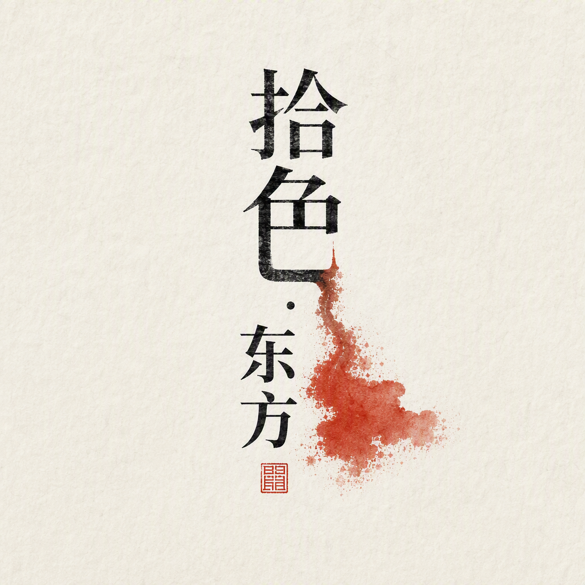
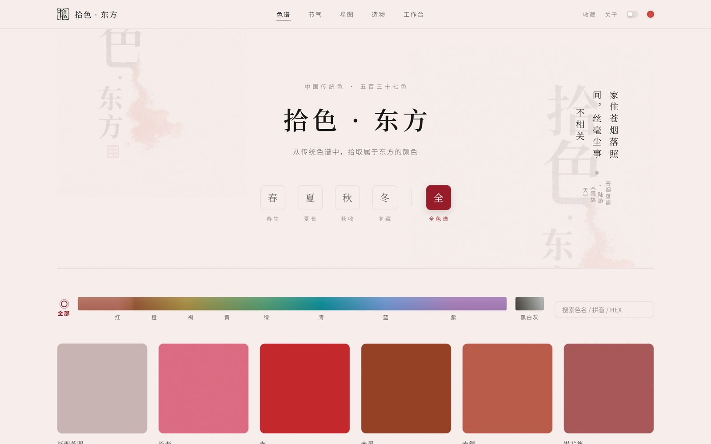
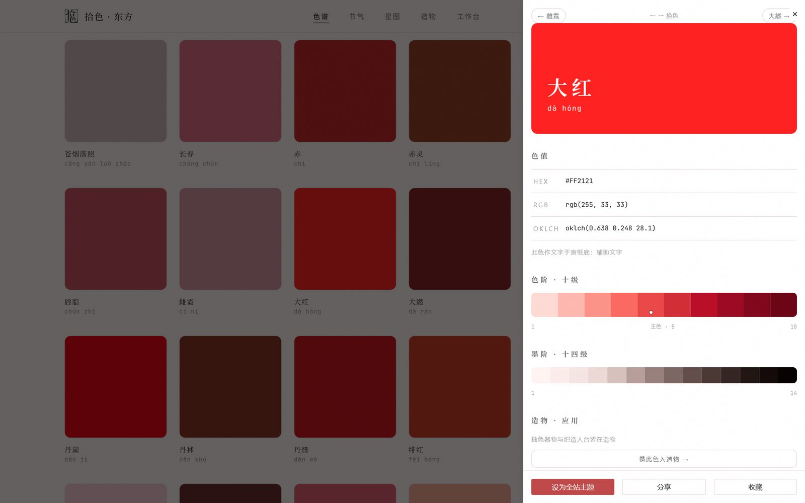
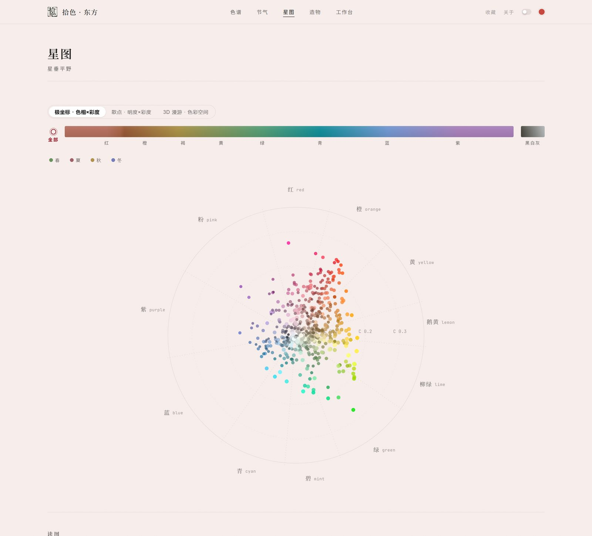
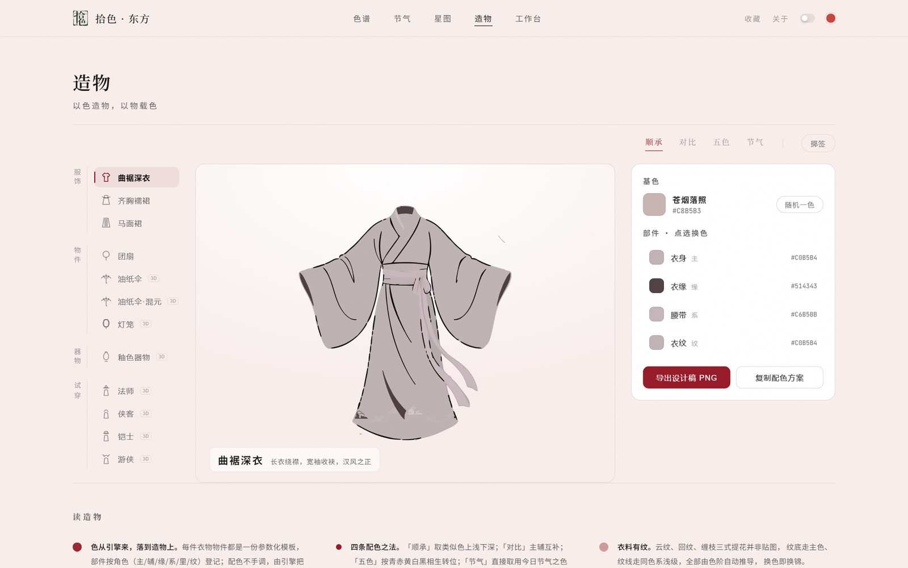
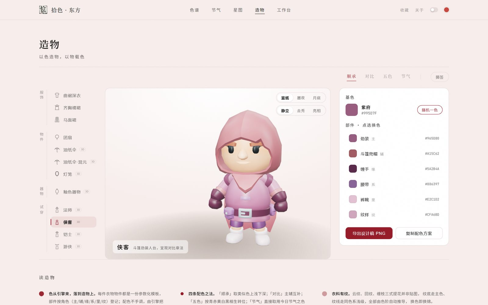
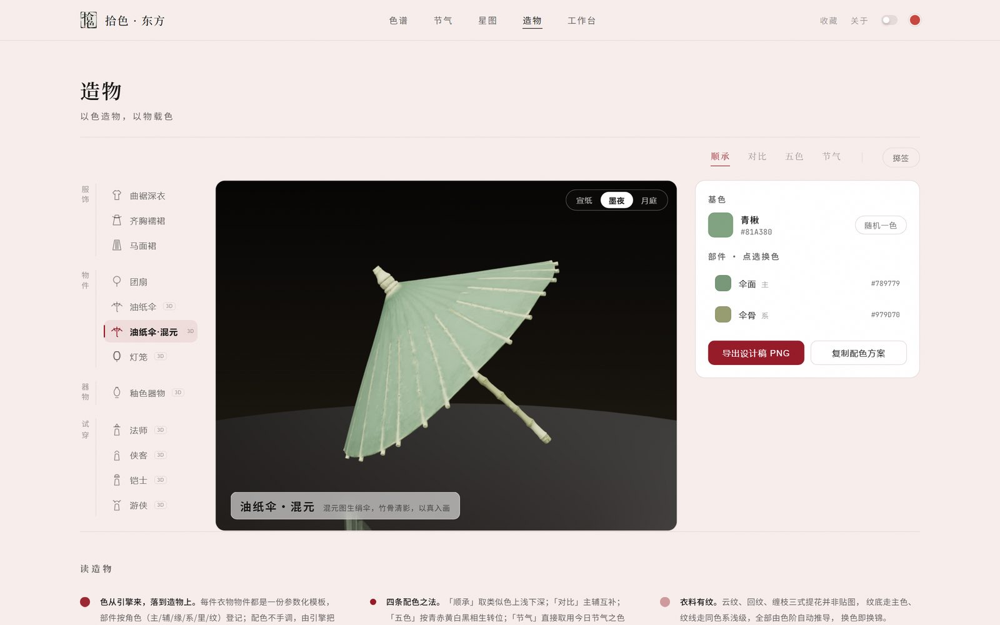
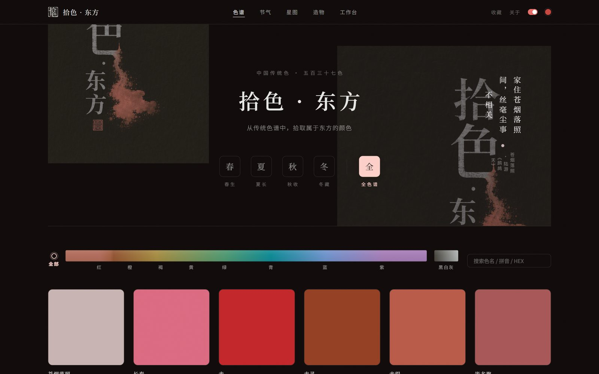

<p align="center">
  
</p>

<h1 align="center">拾色 · 东方</h1>

<p align="center">
  537 只中国传统色 × OKLCH 感知均匀色阶引擎 × TDesign<br>
  <sub>从传统色谱中，拾取属于东方的颜色</sub>
</p>

<p align="center">
  <a href="#特性">特性</a> ·
  <a href="#快速开始">快速开始</a> ·
  <a href="https://shise.xyun.dev">在线演示</a> ·
  <a href="docs/task02/">产品文档</a> ·
  <a href="https://github.com/xy200303/shise-engine">色阶引擎</a>
</p>

<p align="center">
  
</p>

---

腾讯犀牛鸟开源计划 2026 · TDesign 课题实战阶段 **Task 02** 交付产品。
色阶引擎课题（Task 01）：[xy200303/shise-engine](https://github.com/xy200303/shise-engine)。

## 特性

### 色谱 · 五百三十七色

537 只东方传统色，四季 / 九色系 / 色相绸带三种浏览法，拼音去声调搜索。每只色附诗词出处、引擎实时推演的十级色阶与十四级墨阶、互补/类似搭配、WCAG 2.x + APCA 双轨可访问性小注。

<p align="center"></p>

### 星图 · 星垂平野

537 色落入 OKLCH 极坐标星图，引擎 11 个色相分区的直观呈现；另有散点（明度×彩度）与 3D 漫游（纯手写 WebGL 点云 + sRGB 色域壳）两种看法。

<p align="center"></p>

### 造物 · 以色造物，以物载色

衣物物件皆是参数化模板：部件按角色（主/辅/缘/系/里/纹）登记，配色不手调，引擎把基色推演成整案。四条配色之法（顺承 / 对比 / 五色 / 节气），纹样印花、设计稿 PNG 一键导出。

- **矢量插画**：曲裾深衣 / 齐胸襦裙 / 马面裙 / 团扇——Miora 生成、矢量化后由 OKLab 聚类染色引擎分族换染，明度偏移保留褶皱细节
- **3D 试穿间**：法师 / 侠客 / 铠士 / 游侠四座人台（KayKit CC0），UV 调色板格级染色、纹样印花、宣纸/墨夜/月庭三场景、静立/走秀/亮相三动画
- **物件 3D**：油纸伞（程序化建模 + 混元图生 3D 双版本）、灯笼点灯、釉色器物（手写 WebGL 宋式斗笠盏，釉面随色换染）

<p align="center"></p>

<p align="center"></p>

<p align="center"></p>

### 工作台 · 取色 / 配色 / 应用

上传图片，OKLCH 空间 k-means++ 提取主色、DeltaE2000 匹配最近传统色；和谐配色推演与双轨对比矩阵校验；任一传统色生成全套 TDesign Design Token，组件实时换装，CSS / JSON 一键下载。

### 主题 · 一键换染全站

任一传统色可设为全站主题：引擎生成色阶直接替换 TDesign 色彩相关 Design Token，亮 / 暗双模式皆重新生成而非反转。

<p align="center"></p>

## 快速开始

```bash
pnpm install
pnpm dev       # 本地开发
pnpm build     # 构建站点（产物 dist/）
pnpm preview   # 本地预览生产构建
```

## 技术栈

- 色阶引擎 [`shise-engine`](https://github.com/xy200303/shise-engine)（Task 01 算法核心包）以 **git 依赖**（`#v1.2.0` tag 锁定）安装，单一事实来源
- React 18 + TypeScript + Vite + tdesign-react；three.js / 手写 WebGL；Miora 视觉资产；腾讯混元图生 3D
- main 分支推送后由 GitHub Actions 自动构建部署到 Pages

## 目录结构

```
shise-dongfang/
├── src/            # 站点源码（pages / components / zaowu / webgl / data）
├── public/         # 静态资产（logo / 矢量模板 / 3D 模型 / CNAME）
├── tools/          # 矢量化与 GLB 瘦身管线脚本
├── scripts/        # validate-colors.cjs 数据集校验
└── docs/
    ├── images/     # README 产品图
    └── task02/     # 全流程文档与 Miora / 混元资产
```

## 文档

产品动机、设计理念、Miora 与 CodeBuddy 全流程产出记录见 [`docs/task02/`](docs/task02/)。
Miora 视觉资产源文件见 `docs/task02/miora/`；混元 3D 模型经 `tools/slim-glb.mjs` 瘦身后入库 `public/models/youzhisan.glb`（原始 23MB 源文件可从 git 历史取回）。

## 致谢

- [TDesign](https://tdesign.tencent.com/) 组件体系与 Design Token
- KayKit 角色资源（CC0）
- Miora（视觉资产生成）· 腾讯混元 3D（图生 3D）· CodeBuddy（研发提效）
